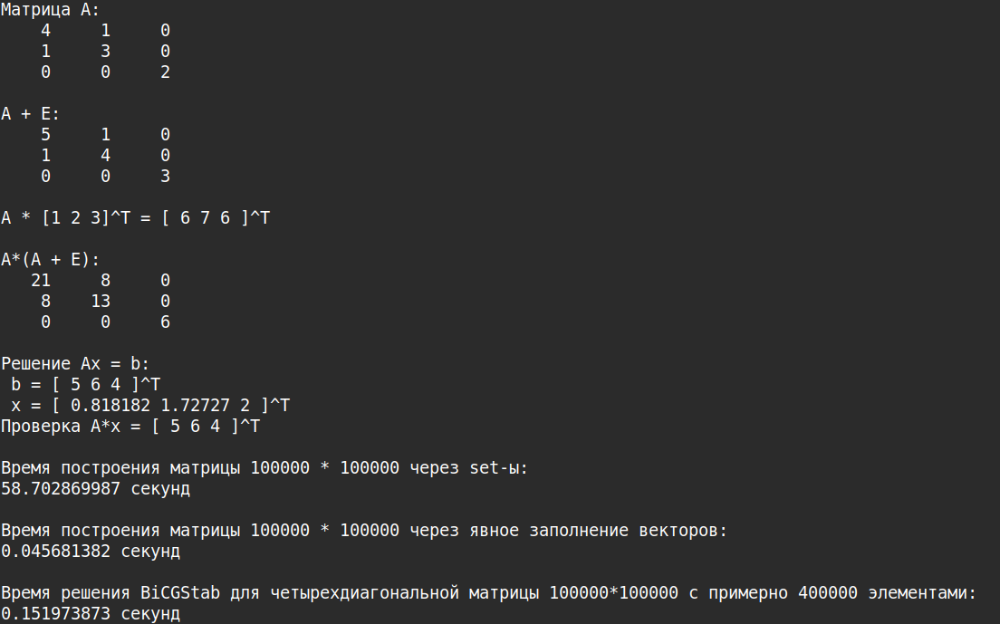

# CSR Sparse Matrix & BiCGStab Solver (C++)

Реализация разреженной матрицы в формате CSR и метода **BiCGStab** для решения систем линейных уравнений на C++.

## Описание

- Header-only реализация класса `CsrMatrix` для работы с разреженными матрицами (формат CSR)
- Основные матричные операции: сложение, вычитание, умножение на скаляр, вектор и другую матриц, транспонирование
- Решатель СЛАУ методом **BiCGStab** -стабилизированный метод бисопряжённых градиентов
  
**Что такое CSR:**  
CSR (Compressed Sparse Row) — это формат хранения разреженных матриц, при котором сохраняются только ненулевые элементы, их номера столбцов и указатели на начало каждой строки. Такой формат позволяет эффективно хранить и умножать большие разреженные матрицы.

## Структура проекта
- include/ # Заголовочные файлы (CsrMatrix.hpp)
- src/ # Примеры использования (main.cpp)
- CMakeLists.txt # Файл сборки (CMake)
- README.md # Этот файл
- LICENSE # Лицензия
  
## Пример работы

### Вывод

В этом проекте реализована разреженная матрица в формате **CSR** и решатель СЛАУ методом **BiCGStab**.

Пример памяти, занимаемой разными форматами матриц:

- Размер матрицы 10⁵ × 10⁵:
  - Плотная (Dense): ~80 ГБ
  - COO: ~10 МБ
  - CSR: ~8 МБ

- Размер матрицы 10⁶ × 10⁶:
  - Плотная (Dense): ~8 ТБ
  - COO: ~96 МБ
  - CSR: ~72 МБ

Как видно, формат CSR позволяет экономить память в десятки тысяч раз по сравнению с плотной матрицей,что делает его пригодным для работы с очень большими системами линейных уравнений.

Метод BiCGStab эффективно решает такие разреженные СЛАУ, демонстрируя практическую применимость реализации.
